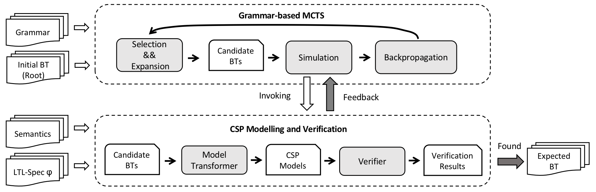
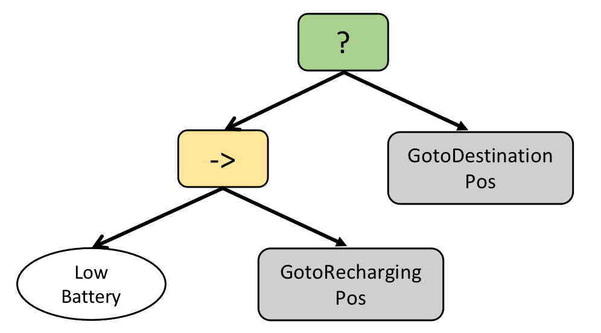
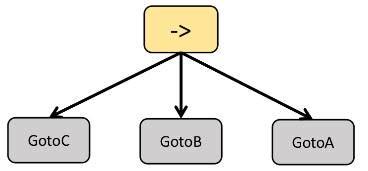
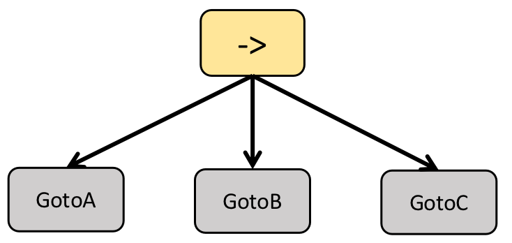
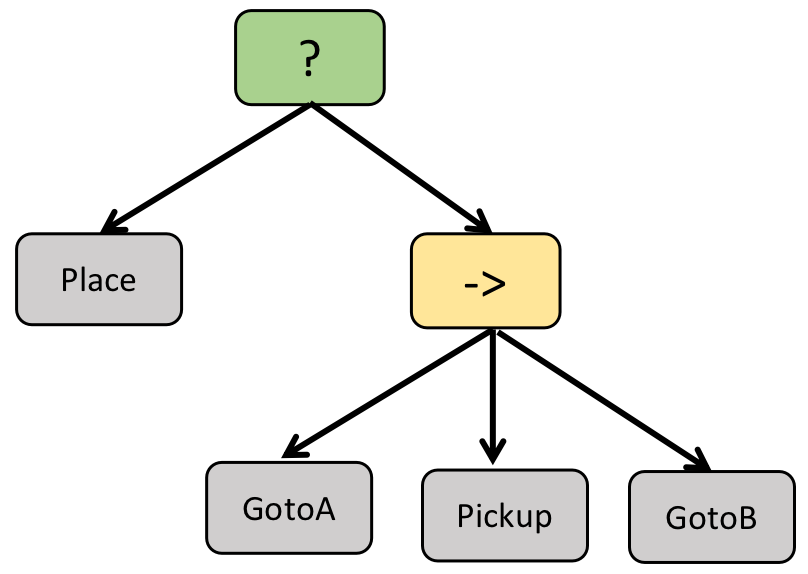
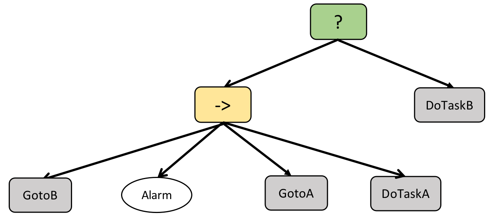

Verifier-aided Synthesis Method for Behavior Trees

- **The source code will be available later.**

***
## Framework
<center>
<figure>

</figure>
</center>


***
## 1. Mission\_charge

- **Mission Description**: The mission contains an unexpected influence factor ***LowBattery*** in the environment. The robot may navigate to the charging position if LowBattery is true or navigate to the destination position if LowBattery is false.

- **Available Nodes**:
	- $Action$:&emsp;  $GotoRechargingPos$, &emsp; $GotoDestination$
	- $Condition$:&emsp;  $LowBattery$, &emsp; $AtRechargingPos$, &emsp; $AtDestinationPos$

- **Semantics**: 

	| Action  | Requirement | Result |
	| :----:  | :----: | :----: |
	| GotoRechargingPos | LowBattery, $\neg$AtRechargingPos     | $\neg$LowBattery, AtRechargingPos, $\neg$AtDestinationPos |
	| GotoDestinationPos   | $\neg$LowBattery, $\neg$AtDestinationPos | $\neg$AtRechargingPos, AtDestinationPos |

- **Specification**: 

	$\varphi = \mathcal{F}\ (LowBattery_s\ \vee\ LowBattery_f)$
	
	$\hspace{0.8cm} \wedge\ \mathcal{F}\ (AtRechargingPos_s\ \vee\ AtDestinationPos_s)$
	
	$\hspace{0.8cm} \wedge\ \mathcal{G}\ (LowBattery_s\to(\ (\neg GotoDestinationPos_s\ \mathcal{U}\ LowBattery_f)\ \vee\ \mathcal{G}\ \neg GotoDestinationPos_s\ )\ )$
	
	
- **Run Information**

	```
	timecost:  173.69546008110046
	verification time ratio:  1.2722 (220.98/173.7)
	storing ratio:  0.879 (437[Verify]+544[NoVerify]/1116)
	pruning ratio:  0.121 (35[Com-V]+44[Incom-V]+56[Incom-S]/1116)
	pruning ratio in verification:  0.1531
	```
- **Synthesized BT**: 
	<center>
	<figure>
	
	</figure>
	</center>


***
## 2. Mission\_patrol$_1$

- **Mission Description**: The mission requires a robot to infinitely visit positions A, B, and C without an order.

- **Available Nodes**:
	- $Action$:&emsp;  $GotoA$, &emsp; $GotoB$, &emsp; $GotoC$
	- $Condition$:&emsp;  $AtA$, &emsp; $AtB$, &emsp; $AtC$  

- **Semantics**: 

	| Action | Requirement | Result |
	| :----: | :----: | :----: |
	| GotoA | \ | AtA, $\neg$AtB, $\neg$AtC |
	| GotoB | \ | $\neg$AtA, AtB, $\neg$AtC |
	| GotoC | \ | $\neg$AtA, $\neg$AtB, AtC |

- **Specification**: 

	$\varphi =	\mathcal{G}\ \mathcal{F}\ GotoA_s\ \wedge\ \mathcal{G}\ \mathcal{F}\ GotoB_s\ \wedge\ \mathcal{G}\ \mathcal{F}\ GotoC_s$

- **Run Information**

	```
	timecost:  123.77410221099854
	verification time ratio:  1.3683 (169.36/123.77)
	storing ratio:  0.9215 (327[Verify]+389[NoVerify]/777)
	pruning ratio:  0.0785 (19[Com-V]+38[Incom-V]+4[Incom-S]/777)
	pruning ratio in verification:  0.1484
	```
- **Synthesized BT**: 
	<center>
	<figure>
	
	</figure>
	</center>

***
## 3. Mission\_patrol$_2$

- **Mission Description**: The mission requires a robot to infinitely visit positions A, B, and C in order.

- **Available Nodes**:
	- $Action$:&emsp;  $GotoA$, &emsp; $GotoB$, &emsp; $GotoC$
	- $Condition$:&emsp;  $AtA$, &emsp; $AtB$, &emsp; $AtC$  

- **Semantics**: 

	| Action | Requirement | Result |
	| :----: | :----: | :----: |
	| GotoA | \ | AtA, $\neg$AtB, $\neg$AtC |
	| GotoB | \ | $\neg$AtA, AtB, $\neg$AtC |
	| GotoC | \ | $\neg$AtA, $\neg$AtB, AtC |

- **Specification**: 

	$\varphi = \mathcal{G}\ (\mathcal{F}\ (GotoA_s\ \wedge\ (\mathcal{F}\ (GotoB_s\ \wedge\ \mathcal{F}\ GotoC_s))))$
	
	$\hspace{0.8cm} \wedge\ (\neg GotoB_s\ \wedge\ \neg GotoC_s)\ \mathcal{U}\ GotoA_s$
	
	$\hspace{0.8cm} \wedge\ \neg GotoC_s\ \mathcal{U}\ GotoB_s$
	
- **Run Information**

	```
	timecost:  182.22315382957458
	verification time ratio:  1.3146 (239.55/182.22)
	storing ratio:  0.914 (479[Verify]+563[NoVerify]/1140)
	pruning ratio:  0.086 (23[Com-V]+55[Incom-V]+20[Incom-S]/1140)
	pruning ratio in verification:  0.14
	```
- **Synthesized BT**: 
	<center>
	<figure>
	
	</figure>
	</center>

***
## 4. Mission\_pickup

- **Mission Description**: The mission requires that a robot needs to navigate to the position A then pick up a cube from A, after that, navigate to the position B and place the cube on B.

- **Available Nodes**:
	- $Action$:&emsp;  $GotoA$, &emsp; $GotoB$, &emsp; $Pickup$, &emsp; $Place$
	- $Condition$:&emsp;  $AtA$, &emsp; $AtB$, &emsp; $Picked$, &emsp; $Placed$  

- **Semantics**: 

	| Action | Requirement | Result |
	| :----: | :----: | :----: |
	| GotoA  | \                 | AtA, $\neg$AtB |
	| GotoB  | \                 | $\neg$AtA, AtB |
	| Pickup | AtA, $\neg$Picked | Picked |
	| Place  | AtB, Picked       | $\neg$Picked, Placed |

- **Specification**: 

	$\varphi =	\mathcal{F}\ Pickup_s\ \wedge\ \mathcal{F}\ Place_s$
	
- **Run Information**

	```
	timecost:  1101.5370717048645
	verification time ratio:  1.3345 (1469.99/1101.54)
	storing ratio:  0.929 (3114[Verify]+3639[NoVerify]/7269)
	pruning ratio:  0.071 (74[Com-V]+239[Incom-V]+203[Incom-S]/7269)
	pruning ratio in verification:  0.0913
	```
- **Synthesized BT**: 
	<center>
	<figure>
	
	</figure>
	</center>

***
## 5. Mission\_alarm

- **Mission Description**: The mission contains an unexpected influence factor ***Alarm*** in the environment. The robot may navigate to the position A to complete TaskA if the alarm occurs or navigate to the position B to complete TaskB if the alarm doesn’t occur.

- **Available Nodes**:
	- $Action$:&emsp;  $GotoA$, &emsp; $GotoB$, &emsp; $DoTaskA$, &emsp; $DoTaskB$
	- $Condition$:&emsp;  $AtA$, &emsp; $AtB$, &emsp; $TaskACompleted$, &emsp; $TaskBCompleted$, &emsp; $Alarm$

- **Semantics**: 

	| Action  | Requirement | Result |
	| :----:  | :----: | :----: |
	| GotoA   | \                 | AtA, $\neg$AtB |
	| GotoB   | \                 | $\neg$AtA, AtB |
	| DoTaskA | AtA, Alarm, $\neg$TaskACompleted              | TaskACompleted |
	| DoTaskB | AtB, $\neg$Alarm, $\neg$TaskBCompleted        | TaskBCompleted |

- **Specification**: 

	$\varphi = \mathcal{F}\ (DoTaskA_s\ \vee\ DoTaskB_s)$
	
	$\hspace{0.8cm} \wedge\ \mathcal{F}\ (Alarm_s\ \vee\ Alarm_f)$
	
	$\hspace{0.8cm} \wedge\ \mathcal{G}\ (Alarm_s\to(\ (\neg DoTaskB_s\ \mathcal{U}\ Alarm_f)\ \vee\ \mathcal{G}\ \neg DoTaskB_s\ )\ )$
	
	$\hspace{0.8cm} \wedge\ \mathcal{G}\ (Alarm_f\to(\ (\neg DoTaskA_s\ \mathcal{U}\ Alarm_s)\ \vee\ \mathcal{G}\ \neg DoTaskA_s\ )\ )$
	
- **Run Information**

	```
	timecost:  2534.806505203247
	verification time ratio:  1.2958 (3284.66/2534.81)
	storing ratio:  0.9476 (6825[Verify]+7561[NoVerify]/15181)
	pruning ratio:  0.0524 (116[Com-V]+237[Incom-V]+442[Incom-S]/15181)
	pruning ratio in verification:  0.0492
	```
- **Synthesized BT**: 
	<center>
	<figure>
	
	</figure>
	</center>


***
## Contacts
Please feel free to contact us if you have any problem.

* hongweijiang17@nudt.edu.cn
